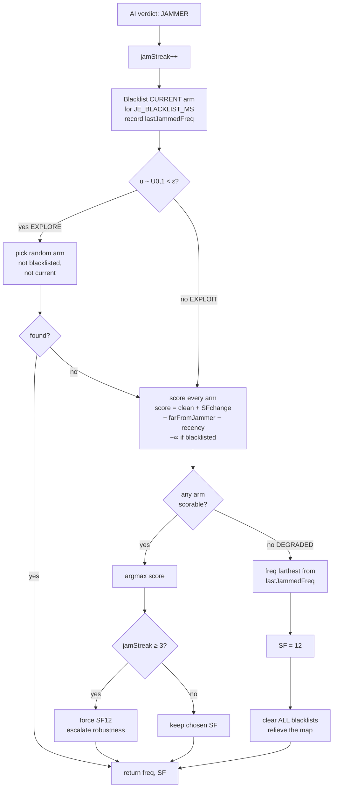
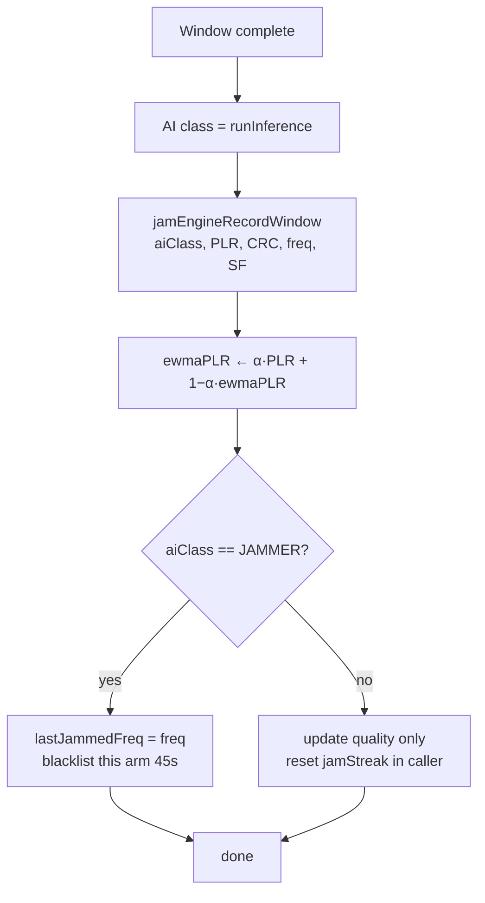

# Cognitive Jamming-Response Engine: Algorithmic Foundations

**A distance-aware, memory-based Multi-Armed Bandit for LoRa anti-jamming channel/SF selection**

---

## 1. Overview

The `jam_engine.h` module solves the **action-selection** problem in a
cognitive radio: *given that the AI classifier has detected jamming, which
(frequency, spreading-factor) configuration should the link move to?*

This is decoupled from **detection** (handled by the Random Forest classifier).
The engine treats each `(frequency, SF)` pair as an **arm** of a
**multi-armed bandit (MAB)** and selects among them using an
**ε-greedy policy** augmented with:

- **EWMA reward tracking** (channel-quality memory),
- **temporary blacklisting** (cooldown / quarantine of failed arms),
- **distance-aware scoring** (never move toward the known jammer),
- a **degraded-mode fallback** for sweeping/following jammers.

---

## 2. The Multi-Armed Bandit (MAB) Formulation

### 2.1 Background

The multi-armed bandit is a classic sequential decision problem: an agent
repeatedly chooses one of *K* "arms," each returning a stochastic reward from
an unknown distribution. The agent must balance **exploration** (trying arms to
learn their reward) against **exploitation** (choosing the best-known arm).
[Sutton & Barto, 2018; Lattimore & Szepesvári, 2020].

### 2.2 Mapping to our problem

| Bandit concept | Our system |
|---|---|
| Arm *a* | A `(frequency, SF)` configuration |
| Number of arms *K* | 7 freqs × 6 SFs = **42 arms** |
| Reward *r(a)* | Link quality = `1 − PLR` on that arm |
| Reward is non-stationary | ✔ — the jammer moves, so arm rewards change over time |

Because the jammer is mobile, this is a **non-stationary bandit**, which is why
we use **EWMA** reward estimates (recent outcomes weighted more) rather than a
simple mean [Sutton & Barto, 2018, §2.5].

---

## 3. ε-Greedy Policy

### 3.1 Definition

The **ε-greedy** algorithm is the canonical MAB strategy
[Watkins, 1989; Sutton & Barto, 2018, §2.2]:

- With probability **1 − ε**: **exploit** — choose the arm with the highest
  estimated value (greedy).
- With probability **ε**: **explore** — choose a random arm, to keep the value
  estimates fresh and discover changes.

```
                 ┌──────────────────────────────┐
   draw u ~ U(0,1)                               │
                 ▼                               │
        ┌─────────────────┐   u < ε   ┌──────────────────────┐
        │  u < ε ?         ├──────────►│ EXPLORE: random arm  │
        └───────┬─────────┘           └──────────────────────┘
                │ u ≥ ε
                ▼
        ┌──────────────────────────────┐
        │ EXPLOIT: argmax_a score(a)    │
        └──────────────────────────────┘
```

In `jam_engine.h`, `JE_EPSILON = 0.10` → **10% exploration, 90% exploitation.**

### 3.2 Why ε-greedy (vs. UCB / Thompson Sampling)

- **ε-greedy** is O(K) per decision, needs no probability model, and is trivial
  to run on an 8-bit/32-bit MCU. Ideal for embedded [Sutton & Barto, 2018].
- **UCB** [Auer et al., 2002] and **Thompson Sampling** [Thompson, 1933;
  Russo et al., 2018] are theoretically tighter but heavier (require confidence
  bounds or posterior sampling). For a 42-arm embedded problem with a
  human-timescale jammer, ε-greedy is sufficient and far cheaper.

---

## 4. EWMA Reward Estimation (Non-Stationary Tracking)

Instead of averaging all past rewards equally, each arm keeps an
**Exponentially-Weighted Moving Average** of its packet-loss rate:

```
ewmaPLR ← α · PLR_new + (1 − α) · ewmaPLR      (α = JE_EWMA_ALPHA = 0.30)
```

- Recent windows dominate → the estimate **adapts** when the jammer leaves a
  channel (that channel's `ewmaPLR` decays back toward 0, becoming attractive
  again).
- This is the standard "constant step-size" update for non-stationary bandits
  [Sutton & Barto, 2018, Eq. 2.5].

---

## 5. Distance-Aware, Memory-Based Scoring

Pure ε-greedy scores arms only by reward. We augment the greedy value with
domain knowledge, producing a composite **score** per arm:

```
score(a) =  w_clean · (1 − ewmaPLR)                     // historically clean
          + w_sf    · f_sf(|SF_a − SF_current|)          // reward SF change
          + w_far   · (dist(freq_a, lastJammedFreq) / span)  // move AWAY from jammer
          − w_rec   · recencyPenalty(a)                   // anti-thrash
          −  ∞       if a is blacklisted (in cooldown)
```

**Rationale for each term:**

| Term | Weight | Purpose |
|---|---|---|
| Cleanliness | `JE_W_CLEAN = 1.0` | Greedy MAB value — prefer low-loss arms |
| **SF change** | `JE_W_SFCHG = 0.8` | LoRa SFs are quasi-orthogonal; changing SF breaks same-SF collision (the dominant jam mechanism) |
| **Freq distance** | `JE_W_FARJAM = 0.6` | Never step *toward* the jammer; at BW125 nearby channels overlap |
| Recency | `JE_W_RECENCY = 0.4` | Penalize recently-used arms → prevents rapid hop thrash |

The **blacklist** term implements **temporary quarantine**: a failed arm is
excluded for `JE_BLACKLIST_MS = 45 s`, then automatically returns
(self-healing). This is conceptually a **tabu/cooldown list**
[Glover, 1989 — Tabu Search].

---

## 6. Degraded Mode (Sweeping/Following-Jammer Fallback)

If **every** arm is blacklisted (the jammer is hitting everything, e.g. a
sweep or follower), the greedy search returns no candidate. The engine then:

1. selects the frequency **farthest** from the last-jammed frequency,
2. forces **SF12** (maximum processing gain + robustness),
3. **clears all blacklists** so the map is not permanently deadlocked.

This guarantees **liveness**: the system always emits a valid action and cannot
lock up.

---

## 7. Full Algorithm Flowchart



---

## 8. Reward-Update Flowchart (per window)



---

## 9. Parameter Summary

| Symbol | Code constant | Value | Meaning |
|---|---|---|---|
| ε | `JE_EPSILON` | 0.10 | Exploration probability |
| α | `JE_EWMA_ALPHA` | 0.30 | EWMA step size (non-stationary tracking) |
| T_bl | `JE_BLACKLIST_MS` | 45 000 ms | Cooldown after a failed arm |
| — | `JE_W_CLEAN/SFCHG/FARJAM/RECENCY` | 1.0/0.8/0.6/0.4 | Score weights |
| K | 7×6 | 42 | Number of arms |

---

## 10. References

1. R. S. Sutton and A. G. Barto, *Reinforcement Learning: An Introduction*,
   2nd ed. MIT Press, 2018. (Ch. 2: Multi-armed bandits, ε-greedy, EWMA.)
2. T. Lattimore and C. Szepesvári, *Bandit Algorithms*. Cambridge Univ.
   Press, 2020.
3. P. Auer, N. Cesa-Bianchi, and P. Fischer, "Finite-time Analysis of the
   Multiarmed Bandit Problem," *Machine Learning*, 47(2–3):235–256, 2002.
   (UCB.)
4. W. R. Thompson, "On the Likelihood that One Unknown Probability Exceeds
   Another in View of the Evidence of Two Samples," *Biometrika*,
   25(3–4):285–294, 1933. (Thompson sampling.)
5. D. Russo et al., "A Tutorial on Thompson Sampling," *Foundations and Trends
   in Machine Learning*, 11(1):1–96, 2018.
6. C. J. C. H. Watkins, *Learning from Delayed Rewards*, PhD thesis, Cambridge
   Univ., 1989. (ε-greedy in RL.)
7. F. Glover, "Tabu Search — Part I," *ORSA Journal on Computing*,
   1(3):190–206, 1989. (Cooldown/quarantine lists.)
8. J. Mitola and G. Q. Maguire, "Cognitive Radio: Making Software Radios More
   Personal," *IEEE Personal Communications*, 6(4):13–18, 1999.
   (Cognitive-radio framing.)
9. LoRa/LoRaWAN spreading-factor orthogonality: C. Goursaud and J.-M. Gorce,
   "Dedicated Networks for IoT: PHY/MAC State of the Art and Challenges,"
   *EAI Endorsed Trans. IoT*, 2015.